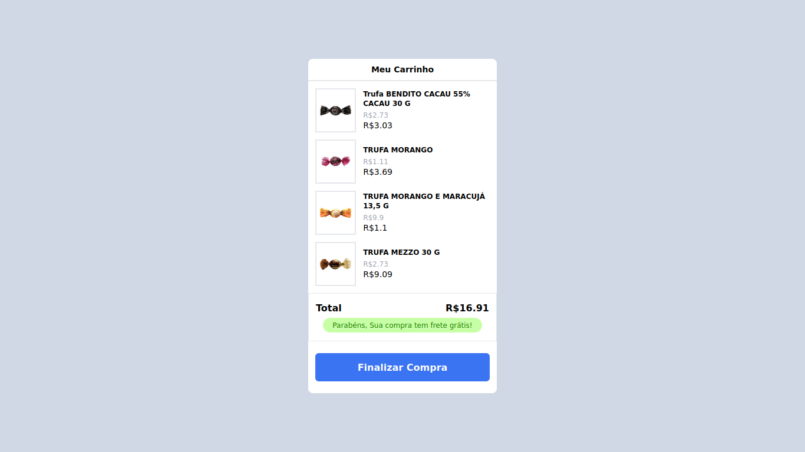

 
 

<h1 align="center">
   
</h1>
 

  <a href="#sobre-o-projeto"> About </a> &nbsp;&nbsp;&nbsp;| &nbsp;&nbsp;&nbsp;
  <a href="#getting-started">Getting started </a> &nbsp;&nbsp;&nbsp;|&nbsp;&nbsp;&nbsp;
  <a href="#techs">Techs</a> &nbsp;&nbsp;&nbsp;|&nbsp;&nbsp;&nbsp;

  
    
  
  

<h1 align="center">
   
</h1>

## Deployed On Vercel
#### Click on the button below to check it out

 

# Sobre o projeto
* ### Objetivos
  * Desenvolver um “Carrinho de compras” usando uma API
  * Listar os produtos, exibir o total da compra e exibir uma mensagem informando se o pedido possui frete grátis.

* ### Requisitos mínimos
  * Listar os produtos provenientes da API.
  * Os produtos devem ter imagem, nome e preço.
  * Exibir ao fim da lista o valor total de todos os produtos.
  * Exibir ao fim da lista o valor total de todos os produtos.
  * O texto de frete grátis deverá aparecer apenas se o valor for acima de R$ 10,00.
  * Seguir o layout
  * Usar Flex-Box CSS
  * Você poderá usar Vanilla JS, React, Vue ou outro framework. Sinta-se a vontade para usar a ferramenta que preferir.
  
# Fui um pouco além
* ### Features
  * Home listando os produtos (Fetch da api `acima.json`)
  * Ao clicar em comprar usuário é direcionado página do produto
  * Pode escolher a quantidade de produtos em sequida adicinar ao carrinho
  * Clicando ao carrinho é direcionado ao proprio, com todos os produtos listados e o preço (Quantidade X Preço), ao passo que for adicionado e quando esse valor atingir o valor $10,00 o texto frete grátis é exibido.
  * Para essa funcionalidade, Redux toolkit foi usado.
  * Outra versão do projeto: <a  target="_blanck" href="https://github.com/eulazzo/testCart-v2">Link</a>

* ### Responsividade
  - [X] Navbar component
  - [X] Hero component
  - [X] Listagem dos produtos
  - [ ] Footer - [Melhorar]
  - [ ] Página do produto

O arquivo json o qual foi feito o fetch está alocado no projeto. 

# CODEBY - Cart Test :shopping_cart: :shopping_cart: :shopping_cart:

## Intro

## Frete grátis (Caso valor adicionado for superior a R$10)

## Adicionando ao carrinho - Frete grátis (Caso valor total adicionado seja superior a R$10)

## Responsivo

 

## Getting started 
 * Clone this repo with  <code>git@github.com:eulazzo/testCart.git</code> ;
 * Move to `testCart-main` folder and run `npm install` to add dependencies;
 * run `npm run start` to start the server.

 
 ## Techs

<table>
   
  <thead>
    <th>Front-end</th>
  </thead>
   
  <tbody>
    <tr>
      <td>ReactJS</td>
    </tr>
     <tr>
      <td>Redux Tool Kit</td>
    </tr>
    <tr>
      <td>TailwindCSS</td>
    </tr>
    <tr>
      <td>Fetch</td>
    </tr>
    <tr>
      <td>React Hooks</td>
    </tr>
  </tbody>
  
</table>
